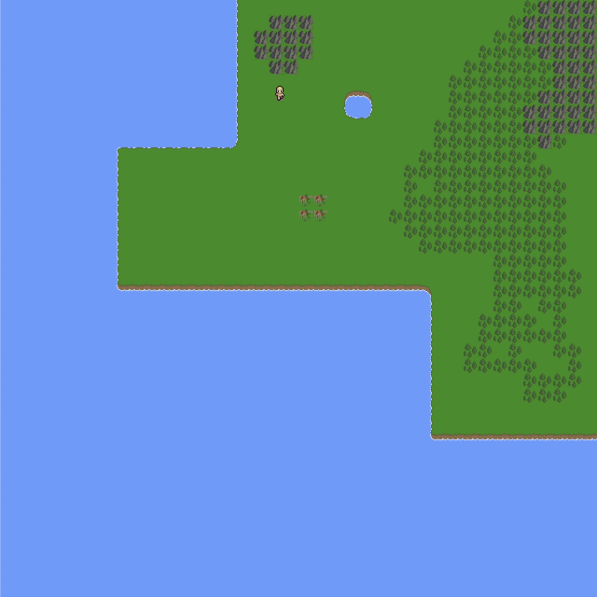

# Phaser setup for the simulations

This is the world that simulations be living in.

## How to run

1. Compile the typescript

```
npm run start
```

2. Run a webserver

```
http-server
```

Tilemap: https://majadroid.itch.io/tiny-islands-16x16-tilemap


